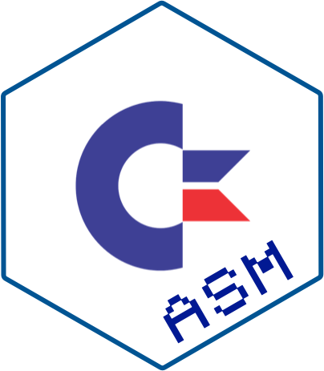
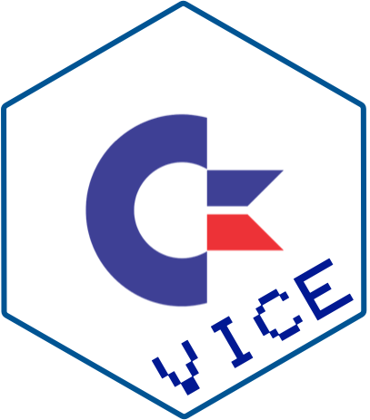

<!-- README.md is generated from README.Rmd. Please edit that file -->

# c64vice 

<!-- badges: start -->


<!-- badges: end -->

[VICE](https://vice-emu.sourceforge.io/) is an emulator for the
[Commodore 64](https://en.wikipedia.org/wiki/Commodore_64).

`{c64vice}` is an interface to the [binary
monitor](https://vice-emu.sourceforge.io/vice_13.html) of a running VICE
emulator.

With `{c64vice}` commands can be sent to the running emulator to:

- Copy bytes into memory
- Read memory locations
- Get/Set the 6502 registers
- Dump/Restore the complete emulator state.
- Take screenshots
- and much much more!

`{c64vice}` uses `socketConnection()` to send/receive raw bytes from the
running emulator.

## What’s in the box

- `req_*` functions for creating the messages understood by the VICE
  binary monitor
- `send_req()` sends a request to VICE and returns the parsed response
  as a named list of information
- `take_snapshot()` takes a screenshot of the emulator and return
  results as a raster
- `save_snapshot()` takes a screenshot and saves the result as PNG
- `run_prg()` takes bytes representing a c64 executable (in PRG format),
  writes it to memory and starts running the code.

## Installation

You can install from [GitHub](https://github.com/coolbutuseless/c64vice)
with:

``` r
# install.package('remotes')
remotes::install_github('coolbutuseless/c64vice')
```

## Setting up `VICE`

In order for `{c64vice}` to be able to communicate with the running VICE
process, the VICE executable must have the binary monitor activated.

If running from the command line, this can be enabled with the
`-binarymonitor` flag i.e.

    x64sc -binarymonitor

The binary monitor can also e configured in the settings when running
VICE:


## Transferring and running code

In this example

- A small assembly program is compiled with `{c64asm}`
- The executable bytes are then transferred to the c64
- A `SYS` command is used to start the program at address 49152
  (‘0xc000’)

``` r
library(c64asm)
library(c64vice)

#~~~~~~~~~~~~~~~~~~~~~~~~~~~~~~~~~~~~~~~~~~~~~~~~~~~~~~~~~~~~~~~~~~~~~~~~~~~~
# Write somd 6502 Assembly
#~~~~~~~~~~~~~~~~~~~~~~~~~~~~~~~~~~~~~~~~~~~~~~~~~~~~~~~~~~~~~~~~~~~~~~~~~~~~
asm <- r"(
; This program rapidly updates the border colour

*=$c000   ; starting address of the program 

start   inc $d020  ; increase border colour
        jmp start  ; repeat
)"

#~~~~~~~~~~~~~~~~~~~~~~~~~~~~~~~~~~~~~~~~~~~~~~~~~~~~~~~~~~~~~~~~~~~~~~~~~~~~
# Use {c64asm} to compile ASM to a c64 PRG executable.
# This ends up being a PRG made up of 8 bytes
#   - the first 2 bytes are the address into which to load the program
#   - everything else is the actual machine code.
#~~~~~~~~~~~~~~~~~~~~~~~~~~~~~~~~~~~~~~~~~~~~~~~~~~~~~~~~~~~~~~~~~~~~~~~~~~~~
prg <- c64asm::compile(asm)
prg
#> [1] 00 c0 ee 20 d0 4c 00 c0
```

``` r
#~~~~~~~~~~~~~~~~~~~~~~~~~~~~~~~~~~~~~~~~~~~~~~~~~~~~~~~~~~~~~~~~~~~~~~~~~~~~
# Load and run the PRG in the current VICE session.
# Note: The first 2 bytes of a PRG are the address, so strip these off
#       before transferring to the c64
#~~~~~~~~~~~~~~~~~~~~~~~~~~~~~~~~~~~~~~~~~~~~~~~~~~~~~~~~~~~~~~~~~~~~~~~~~~~~
req_memory_set(prg[-c(1,2)], start = 0xc000) |>
  send_req()

req_keyboard_feed("SYS 49152\r") |>
  send_req()

#~~~~~~~~~~~~~~~~~~~~~~~~~~~~~~~~~~~~~~~~~~~~~~~~~~~~~~~~~~~~~~~~~~~~~~~~~~~~
# Note: an alternate way to start program execution is to directly 
# set the Program Counter (PC) register to the address
#~~~~~~~~~~~~~~~~~~~~~~~~~~~~~~~~~~~~~~~~~~~~~~~~~~~~~~~~~~~~~~~~~~~~~~~~~~~~
# req_registers_set(PC = 0xc000) |> 
#   send_req()


#~~~~~~~~~~~~~~~~~~~~~~~~~~~~~~~~~~~~~~~~~~~~~~~~~~~~~~~~~~~~~~~~~~~~~~~~~~~~
#' Take a screenshot and plot
#~~~~~~~~~~~~~~~~~~~~~~~~~~~~~~~~~~~~~~~~~~~~~~~~~~~~~~~~~~~~~~~~~~~~~~~~~~~~
ras <- c64vice::take_screenshot()
plot(ras, interpolate = FALSE)
```


## c64-verse

<a href="https://github.com/coolbutuseless/c64tass">
 </a>

<a href="https://github.com/coolbutuseless/c64asm">
 </a>

<a href="https://github.com/coolbutuseless/c64vice">
 </a>

## Acknowledgements

- R Core for developing and maintaining the language.
- CRAN maintainers, for patiently shepherding packages onto CRAN and
  maintaining the repository
